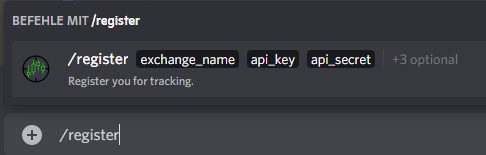
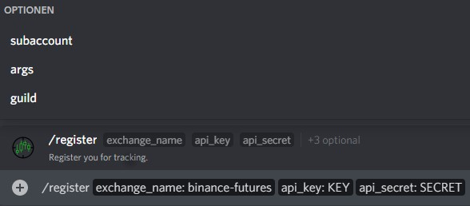
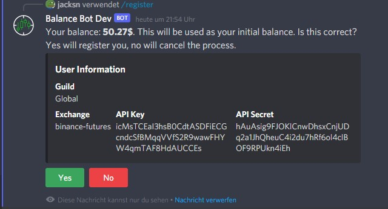

# How to register

1. Type /register into the chat, you should see a popup like this.

2. Click at the popup or press tab.  
   Now type in the parameters.
   - `exchange_name`   The name of the exchange you are trading on.   
      Make sure this is one of the provided options.
   - `api_key` 
       The key to your api access. This access should be read-only.
   - `api_secret`   The secret to your api access.
   - Optional:
     - `subaccount`  
       If you are trading on a subaccount type in the name of it here.
     - `args`  
       Right now, this is only used for KuCoin.  
       KuCoin requires a passphrase.  
       Pass it in through the args option like this: `passphrase=YOUR_PASSPHRASE`

3. If you typed in everything, press enter. The bot will try to read your balance and 
   then ask you to confirm your registration if no errors occured.
   Now, this should show up:

4. Press yes. You are successfully registered!